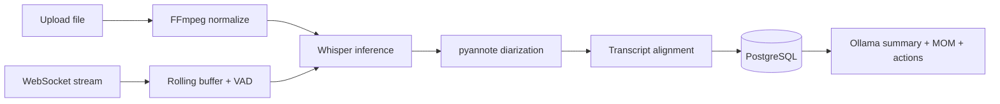

# SpeechFlow

SpeechFlow is a Flask-first speech-to-text and intelligent transcript processing MVP.
It supports upload transcription and realtime streaming with local CPU-only models.

## MVP Scope

- MP3/MP4/WAV upload transcription
- Realtime microphone streaming with live captions
- Speaker diarization
- Transcript persistence and session history
- Summary, MOM, and action items
- TXT/JSON export

## Architecture (MVP)



## Tech Stack

Backend:
- Flask
- Flask-SocketIO
- SQLAlchemy
- PostgreSQL

Speech:
- faster-whisper
- Silero VAD
- pyannote.audio

Audio:
- FFmpeg
- pydub

LLM:
- Ollama
- phi3:mini
- llama3.2 fallback
- bart-large-cnn fallback

Frontend:
- React + Vite

## Repository Structure

```text
speechflow/
  backend/
    app/
      api/
      websocket/
      services/
        audio/
        transcription/
        diarization/
        summarization/
        persistence/
        session/
        utils/
      models/
      schemas/
      utils/
      config/
      workers/
      db/
    requirements/
    tests/
    docs/
      phase1/
  frontend/
  scripts/
  docker/
```

## Local Setup

### Prerequisites

- Python 3.10+
- FFmpeg installed and on PATH
- PostgreSQL running locally
- Ollama installed locally
- HuggingFace token for pyannote

### Environment Variables

- DATABASE_URL
- HF_TOKEN
- OLLAMA_HOST (optional)
- SECRET_KEY (optional)

### Backend

```bash
pip install -r backend/requirements/base.txt
python -m backend.app.main
```

### Python Cache Hygiene (Optional, Dev Only)

Python creates `__pycache__` and `.pyc` files to speed up imports. They are
ignored in git for a cleaner repo.

- Disable bytecode generation for the current shell session:

```bash
source scripts/dev-bytecode-off.sh
```

- Clean generated cache artifacts safely (without touching `.git` or virtualenvs):

```bash
./scripts/clean-python-cache.sh
```

- Manual equivalents:

```bash
find . \( -path "./.git" -o -path "./.sf-env" -o -path "./.venv" -o -path "./venv" -o -path "./env" \) -prune -o -type d -name "__pycache__" -exec rm -rf {} +
find . \( -path "./.git" -o -path "./.sf-env" -o -path "./.venv" -o -path "./venv" -o -path "./env" \) -prune -o -type f \( -name "*.pyc" -o -name "*.pyo" \) -delete
```

These are local developer workflows only and are not required for production.

### Frontend

```bash
cd frontend
npm install
npm run dev
```

## Docs

- backend/docs/architecture.md
- backend/docs/pipeline_flow.md
- backend/docs/database_schema.md
- backend/docs/worker_lifecycle.md
- backend/docs/transition_fastapi_to_flask.md
- backend/docs/phase1/day4_notes.md
- backend/docs/phase1/day5_notes.md
- backend/docs/archive/phase0 (legacy reference)

## Roadmap

- Phase 0 complete (research, benchmarks, feasibility)
- Phase 1 current: upload pipeline implementation
- Phase 2: realtime streaming pipeline
- Phase 3: session history and exports

## Known Limitations

- CPU latency can exceed realtime targets on long sessions
- Diarization quality depends on input audio quality
- Local LLM context limits require chunking for long transcripts

## Docker

Docker support will be added after the local stack is stable.

## License

MIT License
