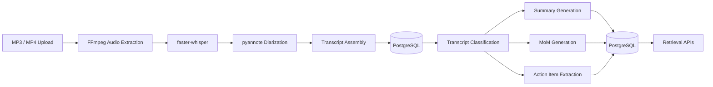

# SpeechFlow

SpeechFlow is a Flask-first speech-to-text and intelligent transcript processing MVP.

It converts uploaded audio/video files into structured outputs including:

- Speaker-labeled transcripts
- Summaries
- Minutes of Meeting (MoM)
- Action items

The project is designed around fully local, CPU-only inference using open-source models.

---

## Current MVP Status

### Completed

#### Upload Processing Pipeline
- MP3 upload support
- MP4 upload support
- File validation
- FFmpeg audio extraction
- Audio normalization
- Background processing workflow

#### Speech Processing
- faster-whisper transcription
- pyannote speaker diarization
- Transcript chunk persistence
- Speaker alignment
- Ordered transcript reconstruction

#### Intelligent Transcript Processing
- Transcript classification
- Summary generation
- Meeting Minutes (MoM) generation
- Action item extraction
- Long transcript chunking
- Map-reduce style summarization
- Local LLM inference via Ollama

#### Persistence
- Session storage
- Transcript storage
- Summary persistence
- Action item persistence
- Reprocessing support

#### APIs
- Upload API
- Transcript retrieval API
- Summary retrieval API
- Action item retrieval API
- Transcript processing API

#### Testing
- Upload pipeline tests
- Transcript processing tests
- Persistence tests
- API tests

---

## Architecture



---

## Tech Stack

### Backend

- Flask
- SQLAlchemy
- PostgreSQL

### Speech Processing

- faster-whisper
- pyannote.audio

### Audio Processing

- FFmpeg
- pydub

### Transcript Intelligence

- Ollama
- phi3:mini

### Testing

- pytest

---

## Repository Structure

```text
speechflow/
  backend/
    app/
      api/
      services/
        audio/
        transcription/
        diarization/
        summarization/
        persistence/
        session/
      models/
      schemas/
      config/
      db/
    requirements/
    tests/
    docs/
      phase1/
      phase2/
  frontend/
  scripts/
```

---

## Local Setup

### Prerequisites

- Python 3.10+
- PostgreSQL
- FFmpeg
- Ollama

### Environment Variables

```bash
DATABASE_URL=
OLLAMA_ENDPOINT=
OLLAMA_TIMEOUT_SECONDS=
HF_TOKEN=
```

### Backend

```bash
pip install -r backend/requirements/base.txt

python -m backend.app.main
```

---

## Implemented API Endpoints

### Upload

```http
POST /api/upload
```

Upload MP3/MP4 audio for transcription.

### Transcript Retrieval

```http
GET /api/sessions/{id}/transcript
```

Returns speaker-labeled transcript.

### Transcript Processing

```http
POST /api/sessions/{id}/process
```

Generates:

- Summary
- Meeting Minutes
- Action Items

### Summary Retrieval

```http
GET /api/sessions/{id}/summary
```

Returns persisted summary and meeting minutes.

### Action Item Retrieval

```http
GET /api/actions/{session_id}
```

Returns persisted action items.

---

## Documentation

### Phase 1

- Upload pipeline implementation
- Transcription pipeline
- Diarization pipeline
- Persistence layer

### Phase 2

- Ollama integration
- Transcript intelligence layer
- Long transcript chunking
- Classification pipeline
- Summary persistence
- Action item persistence

---

## Known Limitations

### Current Model Limitations

phi3:mini occasionally infers:

- attendees
- decisions
- ownership
- action items

even when prompts explicitly prohibit inference.

Future iterations may introduce:

- structured JSON outputs
- schema validation
- rule-based verification
- stronger local models

### Current Product Limitations

Not yet implemented:

- Realtime microphone streaming
- Live captions
- Session history dashboard
- Session status tracking
- TXT export
- JSON export
- Frontend integration
- Docker deployment

### Performance

- CPU-only inference can take 30–120 seconds for large transcripts
- Long transcripts require chunking and merge passes
- Diarization latency depends on audio length

---

## Roadmap

### Phase 1 — Upload Pipeline
✅ Complete

### Phase 2 — Intelligent Processing Layer
✅ Complete

### Phase 3 — Streaming Infrastructure
🚧 Next

### Phase 4 — Session Management & Retrieval
Planned

### Phase 5 — Frontend Integration
Planned

### Phase 6 — Testing, Optimization & Deployment
Planned

---

## License

MIT License